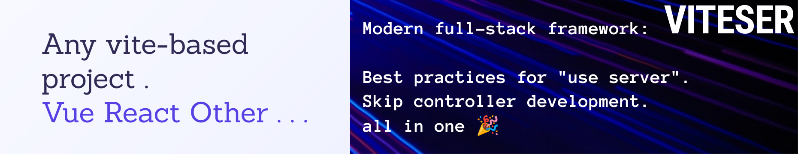

[[ENGLISH](README-en.md)] [[中文](README.md)]

这是一个基于 [[viteser](https://github.com/sia-fl/viteser)] 的最小示例项目。
项目演示了如何标识函数运行在服务端，
运行该项目后打开 f12 可以看到函数已经被转换为接口并被调用。

看了这个用例，如果你想更进一步了解 viteser 的最佳实践。

#### 请了解 https://github.com/sia-fl/buess

这是一个基于 viteser 的项目，演示了如何使用 viteser 开发一个完整的项目。
该项目用于发现并调整 viteser 的缺陷、bug，以及提出新的需求。

